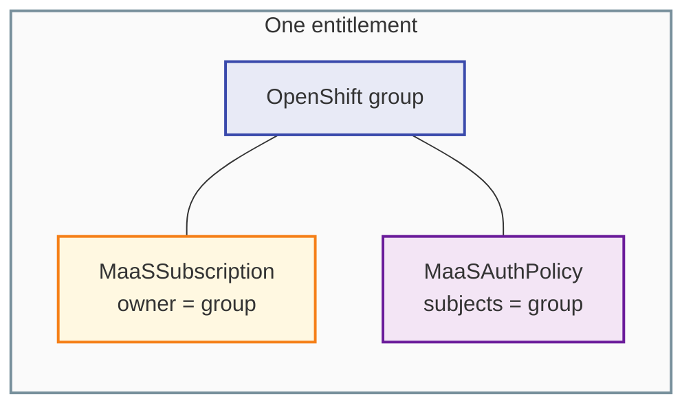
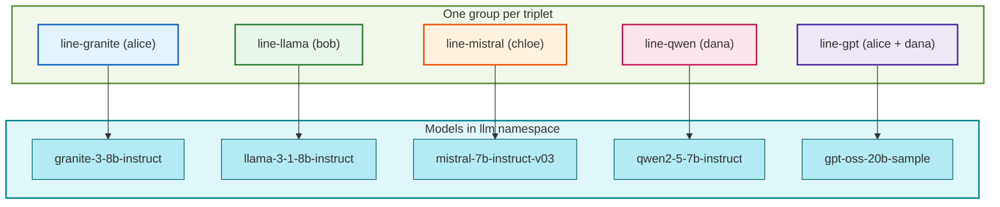

# Demo 01: Paired subscription + policy (one group per entitlement)

This folder is still named **`01-one-to-one`** for short, but the important relationship is **not** “one model per cluster object” — it is **one `MaaSSubscription` paired with one `MaaSAuthPolicy`**, wired together through **the same OpenShift group** (`spec.owner` on the subscription matches `spec.subjects` on the policy). That pairing is the **simplest mental model** when you start with MaaS governance.

## Why choose this pattern?

| Goal | How this demo helps |
|------|---------------------|
| **Onboarding** | You learn the dual check with minimal moving parts: each entitlement is a clear **triplet** (subscription + policy + group). |
| **Auditability** | Finance and security can follow a straight line: *group → subscription (quota) + policy (access) → models*. |
| **Isolation** | Different product lines or cost centers get **different groups**, so entitlements do not overlap unless you add users to multiple groups on purpose. |

It is a good **first** policy layout before you introduce shared tier subscriptions, overlapping owners, or team slices.

## Who’s who in this demo

| Person | OpenShift groups used here | What they get |
|--------|------------------------------|---------------|
| **alice** | `maas-demo-line-granite`, `maas-demo-line-gpt` | Quota + access for **Granite** and **GPT-OSS** (two separate line items). |
| **bob** | `maas-demo-line-llama` | **Llama** only. |
| **chloe** | `maas-demo-line-mistral` | **Mistral** only. |
| **dana** | `maas-demo-line-qwen`, `maas-demo-line-gpt` | **Qwen**; shares **GPT-OSS** with alice (same group = same entitlement). |

Log in as each user (or use `--as` / `--as-group` as a cluster admin) to see only the models that user’s groups unlock.

### OpenShift `Group` membership (this demo)

`manifests/required-groups.yaml` applies **only** the **`maas-demo-line-*`** groups above. If you use the full [common-openshift-groups.yaml](../../shared/identity/common-openshift-groups.yaml) / [deploy/base/groups.yaml](../../deploy/base/groups.yaml) install, the same users also carry **team** and **org** groups used by other demos — see the [full lab identity table](../README.md#full-lab-identity-openshift-groups) in [demos/README.md](../README.md).

| User | `Group` users in this demo’s YAML |
|------|-----------------------------------|
| **alice** | `maas-demo-line-granite`, `maas-demo-line-gpt` |
| **bob** | `maas-demo-line-llama` |
| **chloe** | `maas-demo-line-mistral` |
| **dana** | `maas-demo-line-qwen`, `maas-demo-line-gpt` |

## What “paired” means (subscription ↔ policy via group)

For each entitlement you define:

1. **`MaaSSubscription`** — `spec.owner.groups` names **who** receives **quota** on which models (`spec.modelRefs`).
2. **`MaaSAuthPolicy`** — `spec.subjects.groups` names **who** may **invoke** which models (`spec.modelRefs`).
3. **The same group** appears in both objects so quota and access stay aligned.

That is the **one-to-one** relationship this demo emphasizes: **one subscription pairs with one policy**, not “only one model in the whole platform.”

### One model per pair vs many models per pair (many-to-one)

- **This repository’s YAML** uses **one model per pair** (five triplets) so each row in the matrix is easy to read.
- In production, a **single** pair can include **many** `modelRefs` in **both** the subscription and the policy (a **bundle** SKU). The pattern is unchanged: still **one** subscription, **one** policy, **one** group — only the `modelRefs` lists grow.

So you can read “many-to-one” as **many models** rolling up to **one** subscription+policy+group bundle.

## User / group assumption for this story

For a clean lab, assume **each person maps to one dedicated group** for entitlement (one “hat” per user). That avoids accidental overlap when explaining the triplet. In real life, users sit in many groups; this demo’s [group file](../../shared/identity/common-openshift-groups.yaml) still puts **`alice`** on **two** line-item groups (Granite and GPT) **only** to show that exception explicitly.

## Diagrams

### Subscription ↔ policy ↔ group (core triplet)



### This demo: five triplets, one model each (could be bundled)



## Group and model matrix

| Dedicated group | `MaaSSubscription` | `MaaSAuthPolicy` | Model (`MaaSModelRef` name) |
|-----------------|--------------------|------------------|-----------------------------|
| `maas-demo-line-granite` | `demo01-line-granite` | `demo01-access-granite` | `granite-3-8b-instruct` |
| `maas-demo-line-llama` | `demo01-line-llama` | `demo01-access-llama` | `llama-3-1-8b-instruct` |
| `maas-demo-line-mistral` | `demo01-line-mistral` | `demo01-access-mistral` | `mistral-7b-instruct-v03` |
| `maas-demo-line-qwen` | `demo01-line-qwen` | `demo01-access-qwen` | `qwen2-5-7b-instruct` |
| `maas-demo-line-gpt` | `demo01-line-gpt` | `demo01-access-gpt` | `gpt-oss-20b-sample` |

## Required groups

Subscriptions and policies reference these OpenShift **`Group`** names (see [manifests/required-groups.yaml](manifests/required-groups.yaml)):

| Group | Role in this demo |
|--------|-------------------|
| `maas-demo-line-granite` | Owner + subjects for Granite pair |
| `maas-demo-line-llama` | Llama pair |
| `maas-demo-line-mistral` | Mistral pair |
| `maas-demo-line-qwen` | Qwen pair |
| `maas-demo-line-gpt` | GPT-OSS pair |

Users (`alice`, `bob`, `chloe`, `dana`) must exist in your IdP; membership matches [shared/identity/common-openshift-groups.yaml](../../shared/identity/common-openshift-groups.yaml).

Apply **groups before** entitlements when you are not using the full [deploy](../../deploy/README.md) bundle (which applies all groups via `deploy/base/groups.yaml`):

```bash
oc apply -f demos/01-one-to-one/manifests/required-groups.yaml
```

## Apply

**Recommended (full stack):** from the repository root:

```bash
oc apply -k .
```

That applies simulators, `MaaSModelRef`, **all** demo groups, and this demo’s entitlements (see [deploy/README.md](../../deploy/README.md)).

**Or** models + groups + entitlements by hand:

```bash
oc apply -f demos/01-one-to-one/manifests/required-groups.yaml
oc apply -f demos/01-one-to-one/manifests/maas-entitlements.yaml
```

**Or** only entitlements (if workloads and **groups** already exist):

```bash
oc apply -f demos/01-one-to-one/manifests/maas-entitlements.yaml
```

See upstream [model-setup](https://github.com/opendatahub-io/models-as-a-service/blob/main/docs/content/install/model-setup.md) for how these objects interact with the MaaS operator. Entitlements stay in **`models-as-a-service`** (`MaasTenantConfig`); models stay in **`llm`**. For body-based routing and external models, see [Demo 08](../08-maas-35-features/).

## Files

| File | Role |
|------|------|
| `manifests/required-groups.yaml` | Only the five `maas-demo-line-*` groups for this demo |
| `manifests/maas-entitlements.yaml` | Five subscription+policy pairs (one model per pair in this file) |
