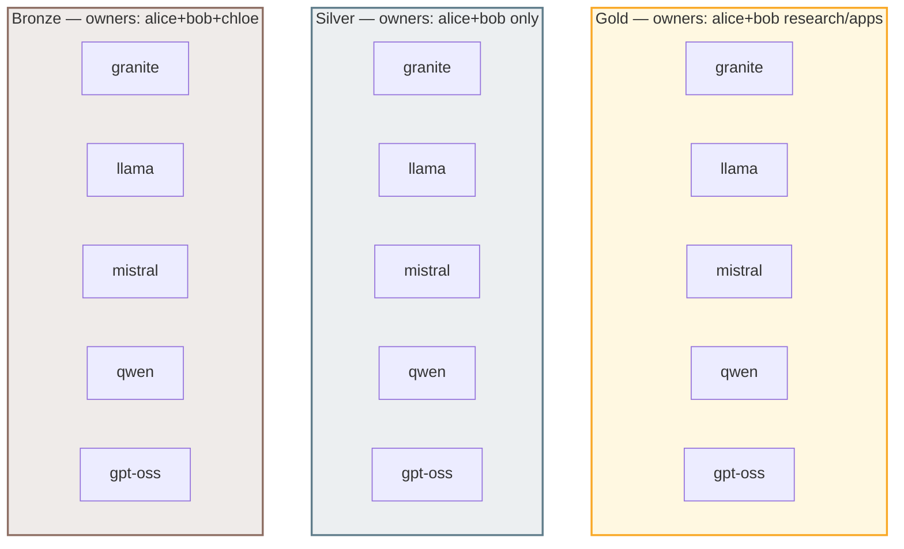
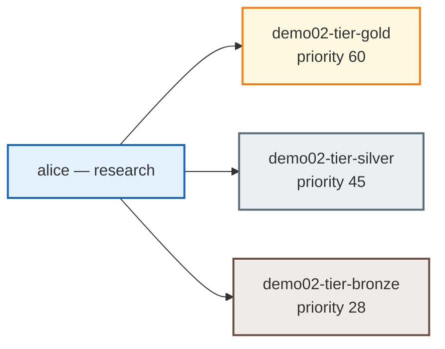
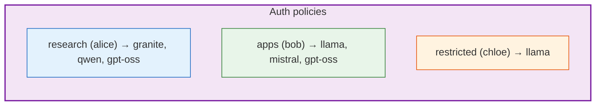

# Demo 02: Tier bundles + overlapping subscriptions + team slices

## Why choose this pattern?

You have **named commercial tiers** (Gold / Silver / Bronze) with **different** token limits and **different** buyer audiences, but you still want **team-level** RBAC: not everyone who bought Gold should see every model. Use **one subscription per tier** (full model list per tier) and **separate `MaaSAuthPolicy` resources** per team to express **who** may call **which** routes. Skip this if you are not selling tiered products or everyone in a tier should see the same models.

## Intent (ODH MaaS)

You sell **three commercial tiers** — **Gold**, **Silver**, **Bronze**. Each tier is a **`MaaSSubscription`** whose `spec.modelRefs` lists **the same five models**; tiers differ by **`tokenRateLimits`** (and **`spec.priority`** for default API key selection). **Gold** and **Silver** share the same owners (**research + apps**). **Bronze** is the only tier that also lists **`maas-demo-restricted`**, so users who are **only** in the restricted group (**chloe**) get **bottom-tier quota** and never appear as owners on Gold or Silver.

**`MaaSAuthPolicy`** resources still **slice** models per team (research vs apps vs restricted), independent of tier. **alice** and **bob** (research + apps) are owners on **Gold, Silver, and Bronze** at once: they inherit **three quota envelopes** for the same catalog. **chloe** (restricted only) is an owner on **Bronze** only—**one** bottom-tier envelope. At API-key creation time, **`spec.priority`** picks the default subscription; callers can bind a key to **`demo02-tier-bronze`** for a cheap sandbox while keeping Gold for production ([MaaS API](https://github.com/opendatahub-io/models-as-a-service/blob/main/maas-api/openapi3.yaml), `subscription` field / `X-MaaS-Subscription` where applicable).

## Who’s who in this demo

| Person | Team groups | Tier subscriptions (quota) | Policy slice (access) |
|--------|-------------|----------------------------|------------------------|
| **alice** | `maas-demo-research` | Gold, Silver, Bronze (owner on all three) | **Research** policy → Granite, Qwen, GPT-OSS |
| **bob** | `maas-demo-apps` | Gold, Silver, Bronze | **Apps** policy → Llama, Mistral, GPT-OSS |
| **chloe** | `maas-demo-restricted` | **Bronze only** (restricted is a Bronze owner; not on Gold/Silver) | **Restricted** policy → Llama only |

**alice** and **bob** are owners on **Gold, Silver, and Bronze**. **chloe** is an owner **only on Bronze**, so her tier quota is **bottom-tier only**—a clear “sandbox / low trust” story. **Access** (which models) still comes from the **team** policy, not from tier name alone.

### OpenShift `Group` membership (this demo)

| User | `Group` users in `manifests/required-groups.yaml` |
|------|---------------------------------------------------|
| **alice** | `maas-demo-research` |
| **bob** | `maas-demo-apps` |
| **chloe** | `maas-demo-restricted` |

For a **combined** lab identity (line-item groups, org, admins, …), see [demos/README.md — Full lab identity](../README.md#full-lab-identity-openshift-groups).

## Diagrams

### Five models × three tiers (each tier covers all models)



### Same person (alice), multiple tier subscriptions



### Policies narrow models per team (orthogonal to tier)



## Tier vs policy

| `MaaSSubscription` | Priority | Owners | Quota character (demo YAML) |
|--------------------|---------|--------|-------------------------------|
| `demo02-tier-gold` | 60 | `maas-demo-research`, `maas-demo-apps` | **2000** tokens/min per model |
| `demo02-tier-silver` | 45 | `maas-demo-research`, `maas-demo-apps` only (**no** restricted) | **500** tokens/min per model |
| `demo02-tier-bronze` | 28 | research, apps, **`maas-demo-restricted`** | **50** tokens/min per model |

| `MaaSAuthPolicy` | Team | Models allowed |
|------------------|------|----------------|
| `demo02-research-slice` | `maas-demo-research` | Granite, Qwen, GPT-OSS |
| `demo02-apps-slice` | `maas-demo-apps` | Llama, Mistral, GPT-OSS |
| `demo02-restricted-slice` | `maas-demo-restricted` | Llama |

**Note:** `maas-demo-restricted` is **not** on Gold or Silver—only **Bronze**—so **`chloe`** is the user who **only** has bottom-tier subscription ownership (in addition to alice/bob on all three tiers).

## Overlapping tier subscriptions (API keys)

**alice** and **bob** are owners on **Gold, Silver, and Bronze** at once. For a given model, the gateway may see **multiple** matching subscriptions unless you pin one:

1. **Mint time:** pass **`"subscription": "demo02-tier-gold"`** (or silver/bronze) on `POST /v1/api-keys`.
2. **Inference:** use a key already bound to the desired subscription, or **`X-MaaS-Subscription`** where your client supports it.

Without that, auto-selection uses **`spec.priority`** (highest first), then limit, then name. **chloe** (Bronze only) avoids this ambiguity.

## Required groups

| Group | Used by |
|--------|---------|
| `maas-demo-research` | Tier owners (Gold/Silver/Bronze) + `demo02-research-slice` policy |
| `maas-demo-apps` | Tier owners + `demo02-apps-slice` policy |
| `maas-demo-restricted` | **Bronze** tier owners only + `demo02-restricted-slice` policy |

Apply before entitlements if you are not using the full [deploy](../../deploy/README.md) base:

```bash
oc apply -f demos/02-tier-based/manifests/required-groups.yaml
```

## Apply

**Full stack (recommended):** see [deploy/README.md](../../deploy/README.md) — use overlay `demo02` with `LoadRestrictionsNone`, or apply by hand:

1. Deploy all five **`MaaSModelRef`** resources in `llm` (or use `deploy/base`).
2. `oc apply -f demos/02-tier-based/manifests/required-groups.yaml`
3. `oc apply -f demos/02-tier-based/manifests/maas-entitlements.yaml`

## Files

| File | Role |
|------|------|
| `manifests/required-groups.yaml` | `maas-demo-research`, `maas-demo-apps`, `maas-demo-restricted` |
| `manifests/maas-entitlements.yaml` | Three tier subscriptions + three auth policies |
