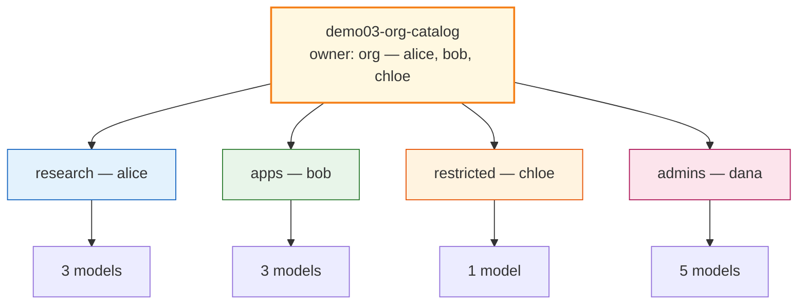

# Demo 03: Single enterprise catalog + four team policies

## Why choose this pattern?

The **enterprise** signs **one** platform contract; **quota** is shared org-wide (`maas-demo-org`), while **policies** still restrict models per team (and **admins** get full access). Use this when procurement is **centralized** but product teams must not all see the same endpoints. Avoid it when each team must be billed on **separate** subscriptions (see [Demo 04](../04-model-sku/) or [Demo 01](../01-one-to-one/) instead).

## Intent (ODH MaaS)

Procurement signs **one** platform deal: a **`MaaSSubscription`** owned by **`maas-demo-org`** lists **all five models** and shared quota. **Team policies** carve the catalog: research, apps, and restricted each see a **subset**; a fourth policy gives **`maas-demo-admins`** the **full** `MaaSModelRef` set for break-glass operations.

This is the same **subscription + slice** mechanism as [Demo 02](../02-tier-based/), but the **story** is “central org contract” vs. “Bronze/Silver/Gold product names.”

## Who’s who in this demo

| Person | Groups | Role |
|--------|--------|------|
| **alice**, **bob**, **chloe** | `maas-demo-org` | **Quota** for the whole catalog comes from the org subscription while they are in this group. |
| **alice** | `maas-demo-research` | **Access** to Granite, Qwen, GPT-OSS via research policy. |
| **bob** | `maas-demo-apps` | **Access** to Llama, Mistral, GPT-OSS via apps policy. |
| **chloe** | `maas-demo-restricted` | **Access** to Llama only. |
| **dana** | `maas-demo-admins` | **Access** to all five models (break-glass); not required to be in `maas-demo-org` for the admin policy. |

So **org** membership answers “do we have quota?”; **team** (and **admin**) groups answer “which routes may I call?”.

### OpenShift `Group` membership (this demo)

| User | `Group` users in `manifests/required-groups.yaml` |
|------|---------------------------------------------------|
| **alice** | `maas-demo-org`, `maas-demo-research` |
| **bob** | `maas-demo-org`, `maas-demo-apps` |
| **chloe** | `maas-demo-org`, `maas-demo-restricted` |
| **dana** | `maas-demo-admins` |

Cross-demo membership for the same users is summarized in [demos/README.md — Full lab identity](../README.md#full-lab-identity-openshift-groups).

## Diagrams

### One subscription, many policies



| Policy | Groups | Models |
|--------|--------|--------|
| `demo03-research-slice` | `maas-demo-research` | Granite, Qwen, GPT-OSS |
| `demo03-apps-slice` | `maas-demo-apps` | Llama, Mistral, GPT-OSS |
| `demo03-restricted-slice` | `maas-demo-restricted` | Llama |
| `demo03-admins-slice` | `maas-demo-admins` | All five |

## Required groups

| Group | Used by |
|--------|---------|
| `maas-demo-org` | `demo03-org-catalog` subscription owner |
| `maas-demo-research` | `demo03-research-slice` policy |
| `maas-demo-apps` | `demo03-apps-slice` policy |
| `maas-demo-restricted` | `demo03-restricted-slice` policy |
| `maas-demo-admins` | `demo03-admins-slice` policy |

```bash
oc apply -f demos/03-org-catalog/manifests/required-groups.yaml
```

## Apply

```bash
oc apply -f demos/03-org-catalog/manifests/required-groups.yaml
oc apply -f demos/03-org-catalog/manifests/maas-entitlements.yaml
```

Or use the [deploy](../../deploy/README.md) overlay `demo03`.

## Files

| File | Role |
|------|------|
| `manifests/required-groups.yaml` | Org + team + admin groups |
| `manifests/maas-entitlements.yaml` | One subscription + four auth policies |
