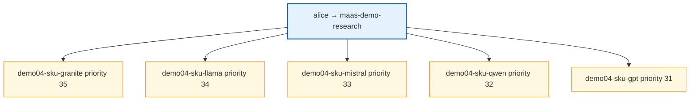
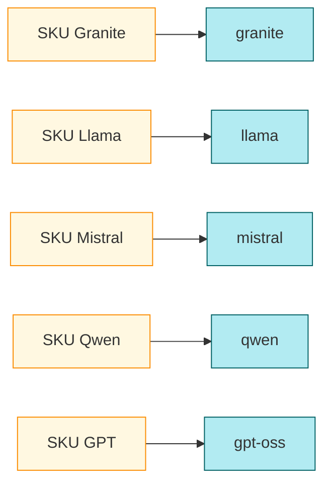

# Demo 04: Five SKUs on one team (multi-subscription bundle)

## Why choose this pattern?

**Finance** wants **per-model** line items and **one** R&D org (`maas-demo-research`) paying for several SKUs. Multiple **`MaaSSubscription`** resources (one model each) with **`spec.priority`** express **default** key selection and **separate** metering per SKU. Use this when **one** team buys **several** add-ons, not when each SKU should map to **its own** group (that is closer to [Demo 01](../01-one-to-one/)).

## Intent (ODH MaaS)

FinOps buys **five separate SKUs** (one per model). **`maas-demo-research`** is **`owner`** on **five** `MaaSSubscription` resources—each has a **single** `modelRefs` entry. **`spec.priority`** runs **35 → 31** so the **default** API key (when the user omits `subscription`) prefers **Granite**’s subscription first; callers can still mint keys bound to **`demo04-sku-gpt`** or others. **Five** `MaaSAuthPolicy` objects mirror the five models for the same group.

## Who’s who in this demo

Only **alice** is in **`maas-demo-research`**. She is the stand-in for “one R&D org bought five SKUs”: all five subscriptions and all five policies point at **her** group, while **`spec.priority`** decides the default subscription when she creates an API key without naming one.

**bob**, **chloe**, and **dana** are not in `maas-demo-research` in [common-openshift-groups](../../shared/identity/common-openshift-groups.yaml), so they would **not** receive quota or access from this demo’s YAML unless you add them to `maas-demo-research`.

### OpenShift `Group` membership (this demo)

| User | `Group` users in `manifests/required-groups.yaml` |
|------|---------------------------------------------------|
| **alice** | `maas-demo-research` |

See [demos/README.md — Full lab identity](../README.md#full-lab-identity-openshift-groups) for how other users are wired in other demos.

## Diagrams

### Five SKUs, one owner group



### SKU → model (1:1)



## Resource list

| Subscription | Priority | Model |
|----------------|----------|--------|
| `demo04-sku-granite` | 35 | `granite-3-8b-instruct` |
| `demo04-sku-llama` | 34 | `llama-3-1-8b-instruct` |
| `demo04-sku-mistral` | 33 | `mistral-7b-instruct-v03` |
| `demo04-sku-qwen` | 32 | `qwen2-5-7b-instruct` |
| `demo04-sku-gpt` | 31 | `gpt-oss-20b-sample` |

## Required groups

All subscriptions and policies use **`maas-demo-research`** (`alice`). Apply if not already present:

```bash
oc apply -f demos/04-model-sku/manifests/required-groups.yaml
```

## Apply

```bash
oc apply -f demos/04-model-sku/manifests/required-groups.yaml
oc apply -f demos/04-model-sku/manifests/maas-entitlements.yaml
```

## Files

| File | Role |
|------|------|
| `manifests/required-groups.yaml` | `maas-demo-research` only |
| `manifests/maas-entitlements.yaml` | Five subscriptions + five auth policies |
