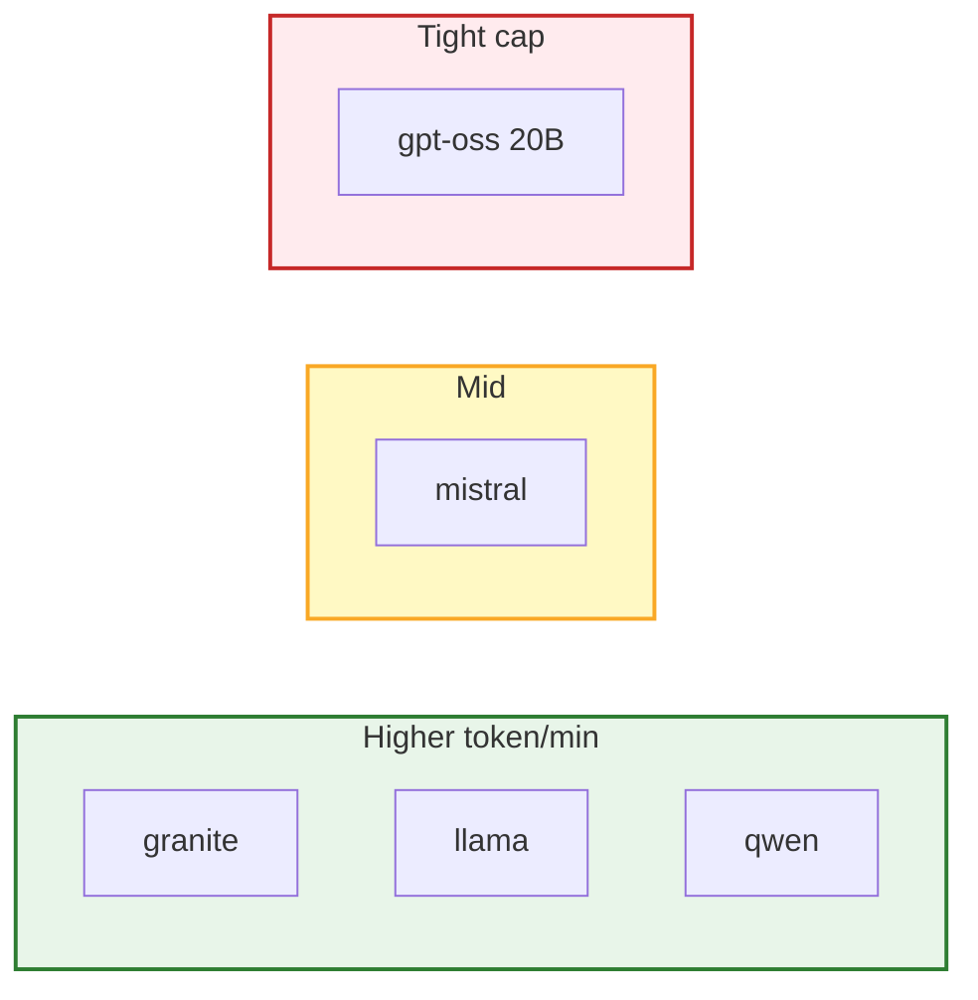
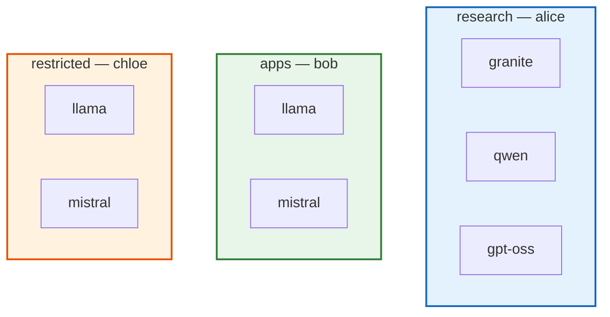

# Demo 05: Full catalog + uneven quota + three team policies

## Why choose this pattern?

You need **one** subscription that covers the **whole** catalog but **expensive** models must have **much lower** token caps than smaller ones. Policies still express **team** access. Choose this when **GPU cost** varies wildly by model; skip it if **per-tier** products already capture the distinction ([Demo 02](../02-tier-based/)).

## Intent (ODH MaaS)

**`MaaSSubscription`** carries **all five models** with **different** `tokenRateLimits` per model (heavy GPU routes get tighter caps). **`MaaSAuthPolicy`** still splits **who** may call **which** models across research, apps, and restricted.

## Who’s who in this demo

| Person | Group | Models they may call (policy) |
|--------|-------|-------------------------------|
| **alice** | `maas-demo-research` | Granite, Qwen, GPT-OSS |
| **bob** | `maas-demo-apps` | Llama, Mistral |
| **chloe** | `maas-demo-restricted` | Llama, Mistral |

All three are **owners** on the same **`MaaSSubscription`** (shared quota envelope), but **policies** limit which models each person can actually invoke.

## Diagrams

### Quota heatmap (per model, same subscription)



### Team × model access



## Policy summary

| Policy | Groups | Models |
|--------|--------|--------|
| `demo05-research-access` | `maas-demo-research` | Granite, Qwen, GPT-OSS |
| `demo05-apps-access` | `maas-demo-apps` | Llama, Mistral |
| `demo05-restricted-access` | `maas-demo-restricted` | Llama, Mistral |

## Required groups

| Group | Used by |
|--------|---------|
| `maas-demo-research` | Subscription owner + research policy |
| `maas-demo-apps` | Subscription owner + apps policy |
| `maas-demo-restricted` | Subscription owner + restricted policy |

```bash
oc apply -f demos/05-quota-overlay/manifests/required-groups.yaml
```

## Apply

```bash
oc apply -f demos/05-quota-overlay/manifests/required-groups.yaml
oc apply -f demos/05-quota-overlay/manifests/maas-entitlements.yaml
```

## Files

| File | Role |
|------|------|
| `manifests/required-groups.yaml` | Research, apps, restricted |
| `manifests/maas-entitlements.yaml` | One subscription + three auth policies |
