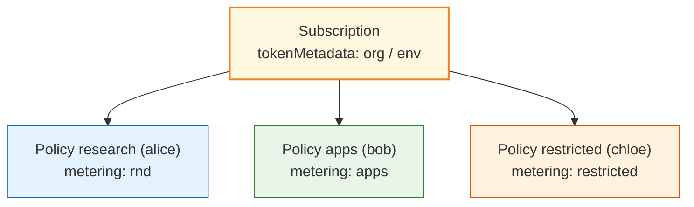
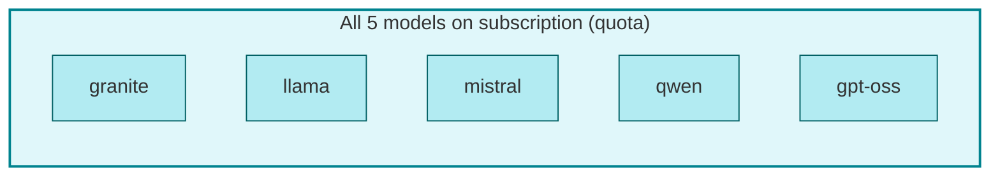

# Demo 06: Metering metadata across five models

## Why choose this pattern?

Billing or FinOps needs **labels** and **chargeback** dimensions on usage in addition to RBAC: **`tokenMetadata`** on the subscription for **platform** context, **`meteringMetadata`** on policies for **team** attribution. Use this when downstream **dashboards** or **billing exports** must key off metadata; it adds little if you only need **who can call what** ([Demo 01](../01-one-to-one/)–[05](../05-quota-overlay/)).

## Intent (ODH MaaS)

**`spec.tokenMetadata`** on **`MaaSSubscription`** tags **organization**, **cost center**, and **labels** (e.g. `env`, `data_class`) for **platform-wide** attribution. **`spec.meteringMetadata`** on each **`MaaSAuthPolicy`** adds **per-team** chargeback labels while **policies** still slice **which** of the five models each group may use.

## Who’s who in this demo

Same people and team splits as [Demo 05](../05-quota-overlay/): **alice** (research), **bob** (apps), **chloe** (restricted). Here the README focus is **billing metadata** on the subscription vs on each policy (`chargeback: rnd-llm`, `app-llm`, `low-risk-llm`), not different users.

### OpenShift `Group` membership (this demo)

Same **`manifests/required-groups.yaml`** as Demo 05:

| User | `Group` users |
|------|---------------|
| **alice** | `maas-demo-research` |
| **bob** | `maas-demo-research`, `maas-demo-apps` |
| **chloe** | `maas-demo-restricted` |

See [demos/README.md — Full lab identity](../README.md#full-lab-identity-openshift-groups) for the full lab matrix.

## Diagrams

### Subscription metadata vs policy metadata



### Model coverage per policy



| Policy | Team | Models | meteringMetadata.labels |
|--------|------|--------|---------------------------|
| `demo06-policy-research` | `maas-demo-research` | Granite, Qwen | `team: research`, `chargeback: rnd-llm` |
| `demo06-policy-apps` | `maas-demo-apps` | Llama, Mistral, GPT-OSS | `team: apps`, `chargeback: app-llm` |
| `demo06-policy-restricted` | `maas-demo-restricted` | Llama | `team: restricted`, `chargeback: low-risk-llm` |

## Required groups

Same three team groups as Demo 05; subscription owners include all three.

```bash
oc apply -f demos/06-abac-environment/manifests/required-groups.yaml
```

## Apply

```bash
oc apply -f demos/06-abac-environment/manifests/required-groups.yaml
oc apply -f demos/06-abac-environment/manifests/maas-entitlements.yaml
```

## Files

| File | Role |
|------|------|
| `manifests/required-groups.yaml` | Research, apps, restricted |
| `manifests/maas-entitlements.yaml` | One subscription + three auth policies |
