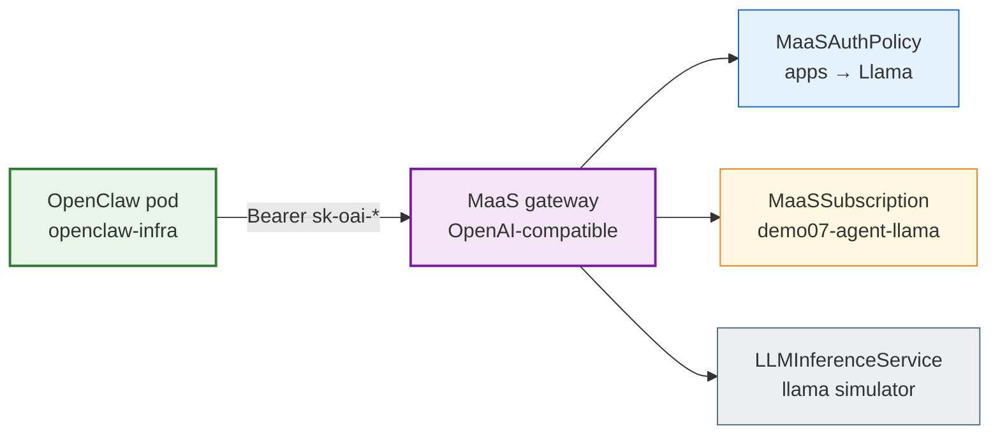

# Demo 07: OpenClaw agent via MaaS (minimal)

## Why choose this pattern?

You run a **real agent runtime** (OpenClaw) that calls models through an **OpenAI-compatible** HTTP API, but you want **enterprise controls** from MaaS: API keys, subscription quota, and auth policies—not a raw inference URL on the cluster network. Use this when you are wiring **bring-your-own-agent** workloads to **Models-as-a-Service** on OpenShift AI.

This demo is intentionally **minimal**: one model (**Llama**), one team group (**apps** / **bob**), one subscription + policy pair. OpenClaw itself is deployed with [redhat-et/openclaw-infra](https://github.com/redhat-et/openclaw-infra); this repo supplies the **MaaS entitlements** and the **wiring steps**.

## Intent (ODH MaaS)

**bob** (`maas-demo-apps`) owns quota on **`demo07-agent-llama`** and may invoke **`llama-3-1-8b-instruct`** via **`demo07-agent-access`**. He mints a long-lived **`sk-oai-*`** key bound to that subscription, then configures OpenClaw to use the MaaS gateway as an OpenAI provider.

## Who’s who in this demo

| Person | Group | Role |
|--------|-------|------|
| **bob** | `maas-demo-apps` | Runs OpenClaw; mints MaaS API key; agent calls Llama through MaaS |
| **alice** | `maas-demo-apps` (also in research in full lab) | Same entitlement as bob if you use combined `deploy/base/groups.yaml` |

### OpenShift `Group` membership (this demo)

| User | `Group` users in `manifests/required-groups.yaml` |
|------|---------------------------------------------------|
| **alice** | `maas-demo-apps` |
| **bob** | `maas-demo-apps` |

## Architecture



## Prerequisites

1. Upstream **MaaS** on OpenShift (RHOAI / ODH **3.5+** / MaaS **v0.1.2+**). Entitlements must live in **`models-as-a-service`** (tenant namespace with **`MaasTenantConfig`**).
2. This repo’s simulators + model refs (overlay **`demo07`** or hand-apply below).
3. **OpenClaw** from [openclaw-infra](https://github.com/redhat-et/openclaw-infra) in a **separate namespace** (for example `bob-openclaw`). Active installer work also lives at [sallyom/openclaw-installer](https://github.com/sallyom/openclaw-installer); this demo documents **openclaw-infra** per your lab choice.
4. For the preferred **body-based** OpenAI base URL, confirm IPP / payload-processing is running in `openshift-ingress` (see [Demo 08](../08-maas-35-features/)).

## Step 1 — Apply MaaS entitlements

**Full stack (recommended):**

```bash
oc kustomize --load-restrictor LoadRestrictionsNone deploy/overlays/demo07 | oc apply -f -
```

Or by hand:

```bash
oc apply -f demos/07-openclaw-agent/manifests/required-groups.yaml
oc apply -f demos/07-openclaw-agent/manifests/maas-entitlements.yaml
```

Wait until `MaaSModelRef` for Llama is **Ready** in namespace `llm`.

## Step 2 — Mint a MaaS API key (as bob)

Log in as **bob** (or use a dedicated kubeconfig — see [deploy/README.md](../../deploy/README.md)).

```bash
CLUSTER_DOMAIN=$(oc get ingresses.config.openshift.io cluster -o jsonpath='{.spec.domain}')
MAAS_API_URL="https://maas.${CLUSTER_DOMAIN}"
OC_TOKEN=$(oc whoami -t)

curl -sS \
  -H "Authorization: Bearer ${OC_TOKEN}" \
  -H "Content-Type: application/json" \
  -X POST \
  -d '{"name":"openclaw-bob","description":"OpenClaw agent key","expiresIn":"30d","subscription":"demo07-agent-llama"}' \
  "${MAAS_API_URL}/maas-api/v1/api-keys" | jq .
```

Save the **`key`** field (`sk-oai-...`) — it is shown **once**.

Discover the model id OpenClaw should send:

```bash
API_KEY='sk-oai-...'
curl -sS -H "Authorization: Bearer ${API_KEY}" \
  "${MAAS_API_URL}/maas-api/v1/models" | jq '.data[] | select(.id|test("llama")) | {id, url}'
```

Prefer **body-based routing** (3.5+): use **`id`** as the model name and a **single** OpenAI base of `${MAAS_API_URL}/v1` (requests go to `/v1/chat/completions`). Path-based `${url}/v1/chat/completions` from discovery still works if IPP is unavailable.

## Step 3 — Deploy OpenClaw (openclaw-infra)

Clone and run the OpenShift installer (separate from this repo):

```bash
git clone https://github.com/redhat-et/openclaw-infra.git
cd openclaw-infra
./scripts/setup.sh
```

Follow the script prompts (namespace prefix, agent name). After deploy, configure the agent’s LLM provider:

| Setting | Value (body-based, preferred) | Value (path-based fallback) |
|---------|-------------------------------|-----------------------------|
| **OpenAI-compatible base URL** | `${MAAS_API_URL}/v1` | Model **`url`** from `/v1/models` |
| **API key** | `sk-oai-...` from Step 2 | same |
| **Model** | `id` from `/v1/models` (Llama simulator) | same |

Exact config keys depend on your OpenClaw / openclaw-infra template (`openclaw.json` or envsubst templates under `agents/openclaw/`). Point the provider at MaaS — **not** at a raw `LLMInferenceService` ClusterIP.

## Step 4 — Verify

**curl via body-based routing (preferred for agents / OpenAI SDKs):**

```bash
MODEL_ID=$(curl -sS -H "Authorization: Bearer ${API_KEY}" \
  "${MAAS_API_URL}/maas-api/v1/models" | jq -r '.data[] | select(.id|test("llama")) | .id')

curl -sS \
  -H "Authorization: Bearer ${API_KEY}" \
  -H "Content-Type: application/json" \
  -d "{\"model\":\"${MODEL_ID}\",\"messages\":[{\"role\":\"user\",\"content\":\"Say hello in one sentence.\"}],\"max_tokens\":64}" \
  "${MAAS_API_URL}/v1/chat/completions" | jq .
```

**Path-based fallback:**

```bash
MODEL_JSON=$(curl -sS -H "Authorization: Bearer ${API_KEY}" "${MAAS_API_URL}/maas-api/v1/models")
MODEL_URL=$(echo "$MODEL_JSON" | jq -r '.data[] | select(.id|test("llama")) | .url')
MODEL_ID=$(echo "$MODEL_JSON" | jq -r '.data[] | select(.id|test("llama")) | .id')

curl -sS \
  -H "Authorization: Bearer ${API_KEY}" \
  -H "Content-Type: application/json" \
  -d "{\"model\":\"${MODEL_ID}\",\"messages\":[{\"role\":\"user\",\"content\":\"Say hello in one sentence.\"}],\"max_tokens\":64}" \
  "${MODEL_URL}/v1/chat/completions" | jq .
```

**OpenClaw UI:** send a chat message in the gateway Control UI; confirm traces / responses and that rate limits apply under **`demo07-agent-llama`**.

## Entitlements summary

| Resource | Purpose |
|----------|---------|
| `demo07-agent-llama` | Subscription — **500** tokens/min on Llama for `maas-demo-apps` |
| `demo07-agent-access` | Policy — apps group may call Llama only |

## Files

| File | Role |
|------|------|
| `manifests/required-groups.yaml` | `maas-demo-apps` |
| `manifests/maas-entitlements.yaml` | Subscription + policy for agent Llama access |

## Related demos

- [Demo 01](../01-one-to-one/) — paired subscription + policy (line-item groups)
- [Demo 02](../02-tier-based/) — overlapping tier subscriptions (use explicit `subscription` on API keys there)
- [Demo 08](../08-maas-35-features/) — BBR, ExternalModel, and multi-tenancy layout for 3.5
