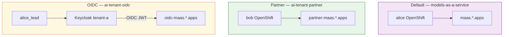

# Demo 08: MaaS 3.5 features (BBR, ExternalModel, multi-tenancy, External OIDC)

## Why choose this pattern?

You want a **single lab** that exercises the headline **RHOAI / ODH 3.5** (MaaS **v0.1.2+**) gateway changes:

| Feature | What this demo shows |
|---------|----------------------|
| **Body-based routing (BBR)** | `POST /v1/chat/completions` — model in the JSON body (IPP) |
| **External models** | llm-katan `ExternalProvider` / `ExternalModel` sims (`sim-chat`, `sim-chat-2`, `sim-messages`) next to on-cluster Granite + paced SSE `sim-stream`; optional live Vertex Claude in [`vertex/`](vertex/) |
| **Multi-tenancy** | **Three** tenants: default, **`partner`**, and **`oidc`** — each with its own Gateway, catalog, and subscriptions |
| **External OIDC** | Third tenant uses **Keycloak** via the **exact upstream** MaaS samples (`setup-keycloak.sh` + `tenant-a` test realm) |

## Intent (ODH MaaS)

### Default tenant — OpenShift alice (`maas-demo-research`)

Gateway `https://maas.<domain>` — hybrid catalog:

1. `granite-3-8b-instruct` in `llm` (on-cluster)
2. External llm-katan sims: `sim-chat`, `sim-chat-2` (OpenAI chat), `sim-messages` (Anthropic messages)
3. `sim-stream` in `llm` — on-cluster streaming sim (~100ms TTFT, **50ms**/token)

Subscription: **`demo08-hybrid-catalog`**.

Simulator values from [testing-with-simulator.md](https://github.com/noyitz/ai-gateway-payload-processing/blob/424b5754c40ef3daca6874ad0b4bd7755a9d23f3/docs/testing-with-simulator.md) (`3-132-132-211.sslip.io`).

### Partner tenant — OpenShift bob (`maas-demo-apps`)

Gateway `https://partner-maas.<domain>`:

1. `partner-mistral-7b` in **`ai-tenant-partner`** (same ns as `MaasTenantConfig` — colocated layout)
2. `partner-llama-3-1-8b` in **`llm-partner`** (kept on the old layout so you can A/B the co-location fix)

Subscription: **`demo08-partner-catalog`** in `ai-tenant-partner`.

### OIDC tenant — Keycloak `alice_lead` (realm **tenant-a**)

Gateway `https://oidc-maas.<domain>` with **`AITenant.spec.oidc`**:

| Setting | Value (from upstream test realm) |
|---------|----------------------------------|
| Issuer | `https://keycloak.<domain>/realms/tenant-a` |
| Client ID | `test-client` |
| Groups | `Engineering`, `Project-Alpha` (JWT `groups` claim) |
| Test user | `alice_lead` / `letmein` |

Models in **`llm-oidc`**: `oidc-qwen-2-5-7b`, `oidc-gpt-oss-20b`.  
Subscription: **`demo08-oidc-catalog`** in `ai-tenant-oidc`.

Keycloak is **not** vendored in this repo. Bootstrap calls upstream scripts from a [models-as-a-service](https://github.com/opendatahub-io/models-as-a-service) checkout — see [docs/samples/install/keycloak](https://github.com/opendatahub-io/models-as-a-service/tree/main/docs/samples/install/keycloak).

## Who’s who

| Identity | Auth | Tenant | Catalog |
|----------|------|--------|---------|
| **alice** (OpenShift) | OpenShift token / API key | default | Granite + llm-katan external sims |
| **bob** (OpenShift) | OpenShift token / API key | partner | Mistral + Llama |
| **alice_lead** (Keycloak) | OIDC JWT → mint API key | **oidc** | Qwen + GPT-OSS |

### OpenShift groups (default + partner)

| User | Groups in `manifests/required-groups.yaml` |
|------|--------------------------------------------|
| **alice** | `maas-demo-research`, `maas-demo-apps` |
| **bob** | `maas-demo-apps` |

OIDC entitlements use **Keycloak** group names (`Engineering`, `Project-Alpha`), not OpenShift Groups.

## Architecture



### Where things live

| Resource | Default | Partner | OIDC |
|----------|---------|---------|------|
| `AITenant` | `models-as-a-service` | `partner` | **`oidc`** (+ `spec.oidc`) |
| Tenant ns | `models-as-a-service` | `ai-tenant-partner` | **`ai-tenant-oidc`** |
| Models | `llm` | Mistral → `ai-tenant-partner`; Llama → `llm-partner` | **`llm-oidc`** |
| Gateway host | `maas.<domain>` | `partner-maas.<domain>` | **`oidc-maas.<domain>`** |
| IdP | OpenShift | OpenShift | **Keycloak `tenant-a`** |

## Prerequisites

1. MaaS **3.5+** / **v0.1.2+** with IPP; `--enable-tenant-namespace-discovery=true` for extra tenants
2. PostgreSQL + **`maas-db-config`** (lab helper: [infra/scripts/setup-postgres.sh](../../infra/scripts/setup-postgres.sh))
3. Local checkout of [opendatahub-io/models-as-a-service](https://github.com/opendatahub-io/models-as-a-service) for Keycloak scripts (`export MAAS_REPO=…`)
4. Network reachability from the cluster to the llm-katan host (`3-132-132-211.sslip.io`) for external-model cells

## Apply scripts

| Script | What it applies |
|--------|-----------------|
| `scripts/apply-default-tenant.sh` | **Main only** — `deploy/overlays/demo08` (sims + llm-katan externals + hybrid catalog) |
| `scripts/apply-partner-tenant.sh` | Partner Gateway / `AITenant` / `llm-partner` (add `--with-default` to include main) |
| `scripts/apply-oidc-tenant.sh` | Keycloak (unless `--skip-keycloak`) + OIDC Gateway / `AITenant` / `llm-oidc` |
| `scripts/apply-all.sh` | **All three** in order (forwards args to the OIDC script, e.g. `--skip-keycloak`) |
| [`vertex/scripts/apply.sh`](vertex/) | Optional live Vertex Claude (needs local `vertex.json`) |

### Default (main) tenant only

```bash
./demos/08-maas-35-features/scripts/apply-default-tenant.sh
```

### Default + partner

```bash
./demos/08-maas-35-features/scripts/apply-partner-tenant.sh --with-default
```

### All three tenants

```bash
# Clone once if needed:
# git clone https://github.com/opendatahub-io/models-as-a-service.git
export MAAS_REPO=/path/to/models-as-a-service

./demos/08-maas-35-features/scripts/apply-all.sh
# or, if Keycloak + realms are already installed:
./demos/08-maas-35-features/scripts/apply-all.sh --skip-keycloak
```

### OIDC tenant only (upstream Keycloak samples)

```bash
export MAAS_REPO=/path/to/models-as-a-service
./demos/08-maas-35-features/scripts/apply-oidc-tenant.sh
# or: ./demos/08-maas-35-features/scripts/apply-oidc-tenant.sh --skip-keycloak
```

`apply-oidc-tenant.sh` **invokes upstream exactly**, then finishes the demo wiring:

1. `${MAAS_REPO}/scripts/setup-keycloak.sh`
2. `${MAAS_REPO}/docs/samples/install/keycloak/test-realms/apply-test-realms.sh`
3. `./infra/scripts/setup-authorino-oidc-ca.sh` — mount OpenShift ingress CA into Authorino so JWT discovery trusts `https://keycloak.<apps-domain>/…`
4. Creates Gateway/Route **`oidc`**, `AITenant/oidc` with `spec.oidc`, `llm-oidc` models, and entitlements

If Keycloak JWT calls return 401 with Authorino logs showing `x509: certificate signed by unknown authority`, re-run step 3 (the Authorino operator can reconcile away the deployment patch).

### External simulator (default tenant)

Secrets + providers + models are applied with the Demo 08 overlay (`manifests/external-model.yaml`). No real OpenAI/Anthropic keys required — lab keys are `llm-katan-openai-key` / `llm-katan-anthropic-key`.

Smoke test (BBR chat):

```bash
# Mint a key against demo08-hybrid-catalog first, then:
curl -sSk \
  -H "Authorization: Bearer ${MAAS_API_KEY}" \
  -H "Content-Type: application/json" \
  -d '{"model":"sim-chat","messages":[{"role":"user","content":"hello"}],"max_tokens":50}' \
  "https://maas.${CLUSTER_DOMAIN}/v1/chat/completions"
```

Path-based (same model):

```bash
curl -sSk \
  -H "Authorization: Bearer ${MAAS_API_KEY}" \
  -H "Content-Type: application/json" \
  -d '{"model":"sim-chat","messages":[{"role":"user","content":"hello"}],"max_tokens":50}' \
  "https://maas.${CLUSTER_DOMAIN}/llm/sim-chat/v1/chat/completions"
```

Anthropic-format messages (BBR):

```bash
curl -sSk \
  -H "Authorization: Bearer ${MAAS_API_KEY}" \
  -H "Content-Type: application/json" \
  -d '{"model":"sim-messages","messages":[{"role":"user","content":"hello"}],"max_tokens":50}' \
  "https://maas.${CLUSTER_DOMAIN}/v1/messages"
```

Streaming on-cluster sim (`sim-stream`, **random** mode, ~50ms/token):

`random` builds synthetic text and honors `max_tokens`. Without `ignore_eos`, length is
sampled from a histogram under that cap (often short) — so ITL can look “ignored”. Force
a full paced stream with `ignore_eos: true`:

```bash
curl -sSk -N \
  -H "Authorization: Bearer ${MAAS_API_KEY}" \
  -H "Content-Type: application/json" \
  -d '{"model":"sim-stream","messages":[{"role":"user","content":"Hello"}],"max_tokens":1000,"stream":true,"ignore_eos":true}' \
  "https://maas.${CLUSTER_DOMAIN}/v1/chat/completions"
```

Verify:

```bash
oc get aitenant -n ai-tenants
oc get maasmodelref -n llm -n llm-partner -n llm-oidc
oc get keycloak -n keycloak-system
```

## Step 3 — Default tenant (alice) BBR

```bash
CLUSTER_DOMAIN=$(oc get ingresses.config.openshift.io cluster -o jsonpath='{.spec.domain}')
MAAS_API_URL="https://maas.${CLUSTER_DOMAIN}"
# oc login as alice
OC_TOKEN=$(oc whoami -t)

# List subscriptions you can access (expect demo08-hybrid-catalog)
curl -sSk -H "Authorization: Bearer ${OC_TOKEN}" \
  "${MAAS_API_URL}/maas-api/v1/subscriptions" | jq .

curl -sS -H "Authorization: Bearer ${OC_TOKEN}" -H "Content-Type: application/json" -X POST \
  -d '{"name":"demo08-alice","subscription":"demo08-hybrid-catalog","expiresIn":"30d"}' \
  "${MAAS_API_URL}/maas-api/v1/api-keys" | jq .
```

## Step 4 — Partner tenant (bob) BBR

```bash
PARTNER_URL="https://partner-maas.${CLUSTER_DOMAIN}"
# oc login as bob
OC_TOKEN=$(oc whoami -t)

# List subscriptions on the partner gateway (expect demo08-partner-catalog)
curl -sSk -H "Authorization: Bearer ${OC_TOKEN}" \
  "${PARTNER_URL}/maas-api/v1/subscriptions" | jq .

curl -sS -H "Authorization: Bearer ${OC_TOKEN}" -H "Content-Type: application/json" -X POST \
  -d '{"name":"demo08-bob","subscription":"demo08-partner-catalog","expiresIn":"30d"}' \
  "${PARTNER_URL}/maas-api/v1/api-keys" | jq .
```

## Step 5 — OIDC tenant (Keycloak → API key → BBR)

Same token flow as upstream [keycloak README](https://github.com/opendatahub-io/models-as-a-service/blob/main/docs/samples/install/keycloak/README.md) / e2e:

```bash
OIDC_URL="https://oidc-maas.${CLUSTER_DOMAIN}"
KEYCLOAK_HOST="keycloak.${CLUSTER_DOMAIN}"

OIDC_TOKEN=$(curl -sk -X POST \
  "https://${KEYCLOAK_HOST}/realms/tenant-a/protocol/openid-connect/token" \
  -d grant_type=password -d client_id=test-client \
  -d username=alice_lead -d password=letmein | jq -r .access_token)

# Decode groups (should include Engineering / Project-Alpha)
echo "${OIDC_TOKEN}" | cut -d. -f2 | base64 -d 2>/dev/null | jq '.groups'

# List subscriptions on the OIDC gateway (expect demo08-oidc-catalog)
curl -sSk -H "Authorization: Bearer ${OIDC_TOKEN}" \
  "${OIDC_URL}/maas-api/v1/subscriptions" | jq .

API_KEY=$(curl -sk -H "Authorization: Bearer ${OIDC_TOKEN}" -H "Content-Type: application/json" -X POST \
  -d '{"name":"demo08-oidc","subscription":"demo08-oidc-catalog","expiresIn":"30d"}' \
  "${OIDC_URL}/maas-api/v1/api-keys" | jq -r .key)
echo "${API_KEY}"

MODEL_ID=$(curl -sk -H "Authorization: Bearer ${API_KEY}" \
  "${OIDC_URL}/maas-api/v1/models" | jq -r '.data[0].id')

curl -sk -H "Authorization: Bearer ${API_KEY}" -H "Content-Type: application/json" \
  -d "{\"model\":\"${MODEL_ID}\",\"messages\":[{\"role\":\"user\",\"content\":\"Hello from OIDC\"}],\"max_tokens\":32}" \
  "${OIDC_URL}/v1/chat/completions" | jq .
```

## Step 6 — Isolation checks

```bash
# Partner key on default gateway — expect 401/403
# Default key on partner / oidc gateways — expect 401/403
# OIDC-minted key on default gateway — expect 401/403
```

## Entitlements summary

| Resource | Namespace | Notes |
|----------|-----------|-------|
| `demo08-hybrid-catalog` | `models-as-a-service` | research → Granite + llm-katan (`sim-chat`, `sim-chat-2`, `sim-messages`) + `sim-stream` |
| `demo08-partner-catalog` | `ai-tenant-partner` | apps → Mistral (`ai-tenant-partner`) + Llama (`llm-partner`) |
| `demo08-oidc-catalog` | `ai-tenant-oidc` | Keycloak `Engineering` / `Project-Alpha` → Qwen + GPT-OSS |
| `AITenant/oidc` | `ai-tenants` | `spec.oidc.issuerUrl` + `clientId: test-client` |

## Files

| Path | Role |
|------|------|
| `manifests/external-model.yaml` | llm-katan ExternalProvider / ExternalModel + MaaSModelRefs |
| `manifests/streaming-model.yaml` | On-cluster `sim-stream` (`LLMInferenceService` + ModelRef; 50ms ITL) |
| `manifests/maas-entitlements.yaml` | Default-tenant subscription/policy |
| `manifests/partner-aitenant.yaml` | `AITenant/partner` with **explicit** `spec.gateway.name: partner` |
| `manifests/partner-models.yaml` / `partner-entitlements.yaml` | Partner catalog (Mistral colocated; Llama control) + quota/access |
| `manifests/oidc-aitenant.yaml` | `AITenant/oidc` with **explicit** `spec.gateway.name` + **`spec.oidc`** (`${OIDC_ISSUER_URL}` filled by script) |
| `manifests/oidc-models.yaml` / `oidc-entitlements.yaml` | OIDC catalog + Keycloak group entitlements |
| `scripts/apply-default-tenant.sh` | Main/default overlay only |
| `scripts/apply-partner-tenant.sh` | Partner Gateway/tenant (`--with-default` optional) |
| `scripts/apply-oidc-tenant.sh` | Upstream Keycloak scripts + oidc Gateway/`AITenant` |
| `scripts/apply-all.sh` | Default → partner → oidc |
| [`vertex/`](vertex/) | Optional live Vertex Claude provider + ModelRef + entitlements |
| [workbooks/](workbooks/) | Jupyter notebooks |

## Workbooks

| Notebook | Shows |
|----------|--------|
| `BodyBasedRouting.ipynb` | Default-tenant BBR |
| `BodyBasedRouting-no-key.ipynb` | Pre-keyed BBR |
| `ExternalModels.ipynb` | llm-katan external sims (`sim-chat`) |
| `TenancyLayout.ipynb` | Default + partner isolation |
| `ExternalOIDC.ipynb` | Keycloak token → API key → BBR on oidc tenant |

## Related

- Upstream [Keycloak samples](https://github.com/opendatahub-io/models-as-a-service/tree/main/docs/samples/install/keycloak)
- Upstream [External OIDC](https://github.com/opendatahub-io/models-as-a-service/blob/main/docs/content/advanced-administration/external-oidc.md)
- Upstream [Multi-Tenant Setup](https://github.com/opendatahub-io/models-as-a-service/blob/main/docs/content/install/multi-tenant-setup.md)
- [llm-katan ExternalModel testing guide](https://github.com/noyitz/ai-gateway-payload-processing/blob/424b5754c40ef3daca6874ad0b4bd7755a9d23f3/docs/testing-with-simulator.md)
- [Demo 07](../07-openclaw-agent/) — agent client with BBR `base_url`
