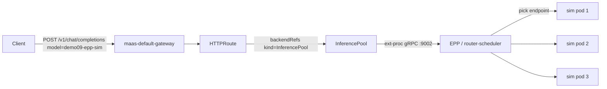

# Demo 09: llm-d Endpoint Picker (EPP) validation

## Why choose this pattern?

You want a **lab that proves** the Gateway API Inference Extension path is active for MaaS — not “looks like load balancing because there is only one pod.”

Someone will claim “EPP is broken / it is just round-robin.” With **one replica** and a plain `Service` backend that claim is unfalsifiable. This demo stands up a **dedicated** simulator where:

| Check | Without EPP | With EPP (this demo) |
|-------|-------------|----------------------|
| `spec.router.scheduler` | unset | `{}` (managed scheduler) |
| Workload replicas | usually `1` | **`3`** |
| `InferencePool` | none | owned by the LLMIS |
| EPP / `*-router-scheduler` | none | Ready |
| HTTPRoute `backendRefs` | `Service` only | **`InferencePool`** |

That is the same repro shape used when validating “is EPP even in the path?” on a live cluster (patch/scale a sim → wait for pool+EPP → confirm route backend → burst traffic).

## Intent

1. Deploy **`demo09-epp-sim`** (`llm-d-inference-sim`) with **`replicas: 3`** and **`router.scheduler: {}`**.
2. Entitlements under the default tenant (`demo09-epp-catalog` / `demo09-epp-access`) with a **high** token cap so burst probes are not stuck on free-tier **100/min**.
3. Run **`validate-epp.sh`** for structural + traffic checks.

Later demos in this folder can grow into other llm-d features (prefix-cache scorers, P/D, etc.). **Start here:** EPP is actually selected.

## Who’s who

| Identity | Auth | What they get |
|----------|------|---------------|
| **alice** (`maas-demo-research`) | OpenShift token / API key | `demo09-epp-sim` |
| **presenter** (`maas-admin`) | OpenShift token / API key | same |

## Prerequisites

- MaaS gateway (`maas-default-gateway`) + Authorino/Kuadrant path working
- KServe LLMIS with Gateway API Inference Extension (cluster has `InferencePool` CRD)
- `oc`, `curl`, `jq`

## Apply

```bash
# From repo root
./demos/09-llm-d-epp/scripts/apply.sh
```

Or:

```bash
oc kustomize --load-restrictor LoadRestrictionsNone deploy/overlays/demo09 | oc apply -f -
oc apply -f demos/09-llm-d-epp/manifests/required-groups.yaml
```

## Validate EPP

```bash
./demos/09-llm-d-epp/scripts/validate-epp.sh
# already applied:
SKIP_APPLY=1 ./demos/09-llm-d-epp/scripts/validate-epp.sh
```

Expected highlights:

```text
PASS: LLMIS demo09-epp-sim: replicas=3, scheduler set
PASS: InferencePool … → EPP Service …
PASS: EPP/router-scheduler readyReplicas=1
PASS: HTTPRoute … backends include InferencePool
PASS: Catalog model id for BBR: publishers/llm/models/demo/epp-sim
PASS: Inference burst: N/N HTTP 200
PASS: Traffic reached ≥2 distinct workload pods …
```

### Catalog id vs Kubernetes name

Body-based routing matches `X-Gateway-Model-Name` on the **catalog id**, derived from `spec.model.name` (`demo/epp-sim` → `publishers/llm/models/demo/epp-sim`). Sending `"model": "demo09-epp-sim"` (the CR name) returns **404**.

```bash
HOST="https://maas.$(oc get ingresses.config.openshift.io cluster -o jsonpath='{.spec.domain}')"
# mint a key bound to demo09-epp-catalog, then:
curl -sS -H "Authorization: Bearer ${API_KEY}" -H 'Content-Type: application/json' \
  -d '{"model":"publishers/llm/models/demo/epp-sim","messages":[{"role":"user","content":"hi"}],"max_tokens":16}' \
  "${HOST}/v1/chat/completions"
```

Path-based (also InferencePool-backed): `${HOST}/llm/demo09-epp-sim/v1/chat/completions` with the same catalog `model` field.

Manual spot-checks (same signals the script uses):

```bash
oc get llminferenceservice demo09-epp-sim -n llm \
  -o custom-columns=REPLICAS:.spec.replicas,SCHEDULER:.spec.router.scheduler
oc get inferencepool -n llm | grep demo09-epp-sim
oc get deploy -n llm | grep demo09-epp-sim
oc get httproute demo09-epp-sim-kserve-route -n llm -o json \
  | jq '.spec.rules[].backendRefs[] | {kind,name,group}'
```

## Architecture



Contrast: without `scheduler`, the route points at a plain `Service` and kube proxy does dumb LB — with one replica there is nothing to schedule.

## Lab hygiene

- This demo is **additive** (dedicated `demo09-epp-sim`). Prefer it over patching e2e fixtures like `facebook-opt-125m-simulated`.
- Tear down:

```bash
oc delete maassubscription demo09-epp-catalog -n models-as-a-service --ignore-not-found
oc delete maasauthpolicy demo09-epp-access -n models-as-a-service --ignore-not-found
oc delete maasmodelref,llminferenceservice demo09-epp-sim -n llm --ignore-not-found
```

## What’s next (llm-d)

| Follow-on | Idea |
|-----------|------|
| Prefix-cache affinity | Same prompt prefix → sticky pod; cold prompts → spread |
| Contrast lab | Twin LLMIS **without** `scheduler` (Service backend) side-by-side |
| P/D | Prefill/decode disaggregation when GPU / sidecar stack is available |
